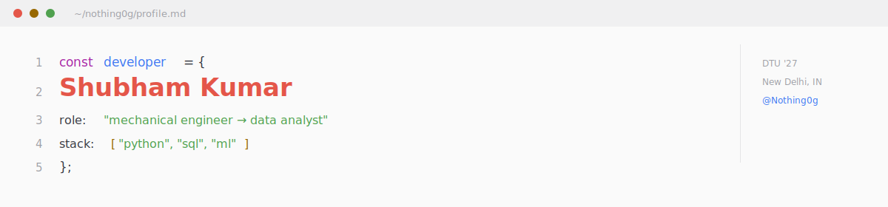

<picture>
  <source media="(prefers-color-scheme: dark)" srcset="./assets/header-dark.svg">
  
</picture>

<br/>
<br/>

<table width="100%" cellspacing="0" cellpadding="12" border="0">
<tr>
<td width="66%" valign="top">

### Field notes

I'm a final-year Mechanical Engineering student at Delhi Technological University, currently redirecting an engineer's discipline for structure and rigor toward data and business analytics.

I don't just run EDA and stop at charts — I chase the *why*. In an HR attrition study, that meant tracing a 3× churn gap to overtime and choosing a model for recall over raw accuracy, not just accuracy for its own sake. In a 150K-row ride-demand analysis, it meant proving a flat 25% failure rate was a structural reliability problem, not a rush-hour supply one.

That habit — break it down, find the driver, then decide — came from CAD tolerances and CAESAR II stress reports long before it showed up in a Jupyter notebook. It's the same instinct, pointed at a different kind of system.

</td>
<td width="34%" valign="top">

**Status**
```
role     seeking
type     analyst / BA
based    New Delhi, IN
```

**Currently**
CrackNonTech Analyst Fellowship

**Previously**
Engineers India Ltd (Plant Design)
DRDO-SSPL (Cryogenics)
NTPC Dadri (RLI)

**Reach me**
[LinkedIn](https://www.linkedin.com/in/shubham-kumar-diff/) · [Email](mailto:shubham1sure@gmail.com) · [Portfolio](https://nothing0g.github.io)

</td>
</tr>
</table>

<br/>

---

### Instruments

<table width="100%" cellspacing="0" cellpadding="10" border="0">
<tr>
<td width="50%" valign="top">

**Analysis**
`Python` `SQL` `Pandas` `scikit-learn` `Power BI` `Excel`

</td>
<td width="50%" valign="top">

**Engineering**
`AutoCAD` `SolidWorks` `ANSYS` `Fusion 360`

</td>
</tr>
</table>

---

### Case files

<table width="100%" cellspacing="8" cellpadding="10" border="0">
<tr>
<td width="50%" valign="top">

**HR Attrition Analysis**
EDA + ML on 1,470 employees

Overtime employees churn at **3×** the rate of others (31% vs 10%). Chose Logistic Regression over Random Forest for **56% recall** on at-risk employees — the metric the business actually needed, not the one that looked best on paper.

`Python` `scikit-learn` — [repo →](https://github.com/Nothing0g/hr_employee_attrition_analysis)

</td>
<td width="50%" valign="top">

**Uber Ride Demand Analytics**
Time-series EDA on 150K bookings

Demand swings **9×** by hour, yet a flat **25% failure rate** persists across every hour — reframing the fix from "add supply at peak" to "fix structural reliability."

`Python` `pandas` — [repo →](https://github.com/Nothing0g/Uber_ride_demand_analysis)

</td>
</tr>
<tr>
<td width="50%" valign="top">

**Loan Approval Analysis**
Classification on applicant risk data

Exploratory and predictive modeling to flag approval risk factors ahead of decisioning.

`Python` — [repo →](https://github.com/Nothing0g/loan-approval-analysis)

</td>
<td width="50%" valign="top">

**User Behavior Analytics — CultFit**
Survey-driven MVP, 200 respondents

Identified *lack of motivation* as the core dropout driver; built an MVP around one lever — competition. Recognized at a Dell Aspire industry event.

`Thunkable` — [repo →](https://github.com/Nothing0g/My_python.projects)

</td>
</tr>
</table>

---

<div align="center">


</div>

---

<div align="center">

**Dell Aspire Scholar '23** &nbsp;&#8226;&nbsp; **NCC 'A' Certificate** &nbsp;&#8226;&nbsp; **EIL Internship — Excellent**

<sub>Always happy to connect — reach out via LinkedIn or email above.</sub>

</div>
